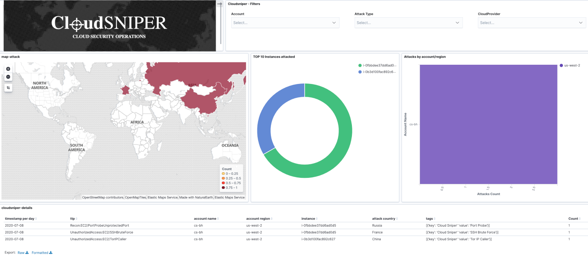

## *Cloud Security Operations*

***Cloud Sniper*** is a platform designed to manage Cloud Security Operations, intended to respond to security incidents by accurately analyzing and correlating cloud artifacts. It is meant to be used as a *Cloud Security Operations* platform to detect and remediate security incidents by showing a complete visibility of the company's cloud security posture.

We are presenting a centralized Incident and Response platform, which executes automatic actions, by learning from the analysts' expert knowledge. To do it, only native cloud artifacts and open source technologies are implemented. In this way, the community can extend the project with different security use cases.

***Cloud Sniper*** receives and processes security feeds, providing an automatic response mechanism to protect the cloud infrastructure. To detect attackers' advanced *TTPs*, ***Cloud Sniper Analytics*** module correlates IOCs providing enhanced security findings to the security analyst.

With this platform, you get a complete and comprehensive management system of the security incidents. At the same time, an advanced security analyst can integrate Cloud Sniper with external forensic or incident-and-response tools to ingest new security feeds. The platform automatically deploys and provides cloud-based integration with all native resources, in a fully modularized manner, making it very easy to extend for the community.

The system is currently available for *AWS*, but it is to be extended to others cloud platforms.

### Some cool features (terraform | python | docker | Kibana)

1. Security automation (multi-account|multi-region)
   1. Incident and Response automation
   2. IAM activity
2. Cloud Sniper Analytics
   1. Enhanced lambda for C2 detection
3. ELK
   1. Incident and Response pipeline
   2. Incident and Response dashboard templates
4. Messaging|Alerts
   1. Slack
   2. Email

### AWS terraform deployment

### Upcoming features

1. Security automation
   1. Dangling DNS records automation
   2. Open|orphans security groups automation
2. Cloud Sniper Analytics
   1. CloudTrail IAM analytics
3. ELK
   1. Cloud Sniper Kibana application
   2. New security dashboards
   3. Open Distro alerting

### Releases

#####  EKOLABS - EKOPARTY 2019 (terraform | python | docker)
Authors:  
[Nicolás Rivero Corvalán - Security Automation](https://www.linkedin.com/in/riveronicolas/)  
[Matías Marenchino - Security Analytics](https://www.linkedin.com/in/mlmarenchino/)

#####  ARSENAL - BLACK HAT USA 2020 (terraform | python | docker | ELK)
Authors:  
[Nicolás Rivero Corvalán - Security Automation](https://www.linkedin.com/in/riveronicolas/)  
[Matías Marenchino - Security Analytics](https://www.linkedin.com/in/mlmarenchino/)  
[Santiago Friquet - Security Automation](https://www.linkedin.com/in/santiago-friquet/)

### Contact us: [EMAIL](mailto:cloudsniper.cba@gmail.com) - [SLACK](https://join.slack.com/t/cloudsniper/shared_invite/zt-gdto90pu-C25tsP54IOqTZd8ykQHmTw)

### Donations

If you wish to support this project you can donate bitcoins (BTC) here: 14WRfmMhQS5auzFAhzfaBW9niqy1QF3Pdw

### Legal

This project is licensed under the terms of the MIT license.