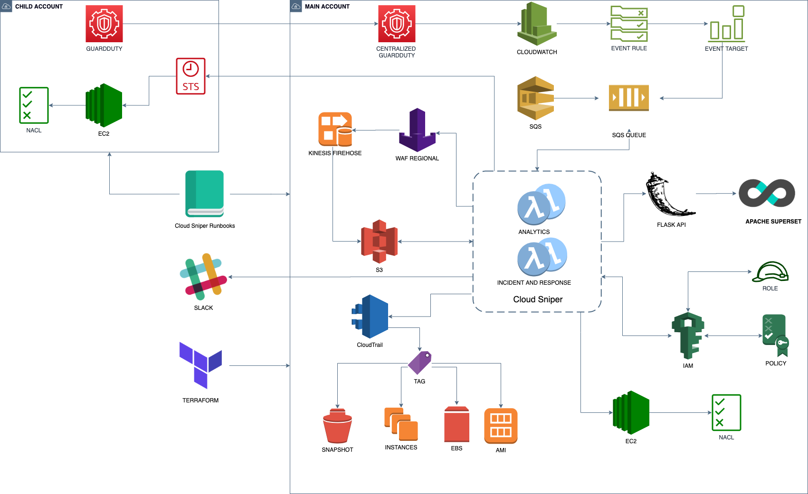

   
## *Cloud Security Operations*

### *What is Cloud Sniper?*

***Cloud Sniper*** is a platform designed to manage Cloud Security Operations, intended to respond to security incidents by accurately analyzing and correlating cloud artifacts. It is meant to be used as a Cloud Security Operations platform to detect and remediate security incidents by showing a complete visibility of the company's cloud security posture.

We are presenting a centralized Incident and Response platform, which executes automatic actions, by learning from the analysts' expert knowledge. To do it, only native cloud artifacts and open source technologies are implemented. In this way, the community can extend the project with different security use cases.

***Cloud Sniper*** receives and processes security feeds, providing an automatic response mechanism to protect the cloud infrastructure. To detect attackers' advanced TTPs, ***Cloud Sniper Analytics*** module correlates IOCs providing enhanced security findings to the security analyst.

With this platform, you get a complete and comprehensive management system of the security incidents. At the same time, an advanced security analyst can integrate Cloud Sniper with external forensic or incident-and-response tools to ingest new security feeds. The platform automatically deploys and provides cloud-based integration with all native resources, in a fully modularized manner, making it very easy to extend for the community.

*Is currently available for AWS, but it is to be extended to others cloud platforms.*

### [Wiki - How it works](wiki/WIKI.md)

## *UPCOMING major release - Black Hat Arsenal 2020*

###  New features (terraform | python | docker | kubernetes | Elastic-Kibana SIEM)

1. AWS multi-account Incident and Response automationSecurity automation
2. IAM activity
3. Cloud Sniper Analytics - Enhanced lambda for C2 detection
4. Elastic | Kibana SIEM integration
   1. Kubernetes deployments
   2. Docker files
   3. Incident and Response dashboard templates
5. Messaging integration
   1. Slack

### NEW deployment

   

### Cloud Sniper released

####  EKOLABS - EKOPARTY Security Conference 2019 (terraform | python | docker)
1.  Automatic Incident and Response
    1.  WAF filtering
    2.  NACLs filtering
    3.  IOCs knowledge database
2.  Automatic tagging
3.  Cloud Sniper Analytics
4.  Beaconing detection with VPC Flow Logs
5.  Terraform cloud-based security runbooks

Authors:  
[Nicolás Rivero Corvalán - Security Automation](https://www.linkedin.com/in/riveronicolas/)  
[Matías Marenchino - Security Analytics](https://www.linkedin.com/in/mlmarenchino/)

### Contact us: <cloudsniper.cba@gmail.com>
