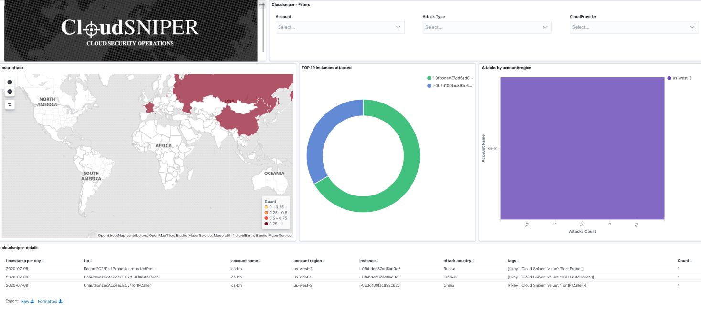

<div style="text-align:center"></div>


# *Cloud Security Operations*

***Cloud Sniper*** is a detection-as-a-code platform designed to manage Cloud Security Operations, intended to respond to security incidents by accurately analyzing and correlating cloud artifacts. It is meant to be used as a *detection-as-a-code platform* to detect and remediate security incidents by showing a complete visibility of the company's cloud security posture.

Cloudsniper join native cloud artifacts and open source technologies with automation to easily response and remediate security issues/incidentes. We remaint to be an opensource platforn to allow the community can extend the project with different security use cases.

With cloudsniper, you get a complete and comprehensive management system of the security incidents. At the same time, an advanced security analyst can integrate Cloud Sniper with external forensic or incident-and-response tools to ingest new security feeds. The platform automatically deploys and provides cloud-based integration with all native resources using terraform (in a fully modularized manner) making it very easy to extend for the community.

The system is currently available for *AWS*, but it is to be extended to others cloud platforms.

## Some cool features (terraform | python | docker | kibana)

1. Security automation (multi-account|multi-region)
   1. Incident and Response automation
   2. IAM activity
2. Cloud Sniper Analytics
   1. Enhanced lambda for C2 detection
3. ELK
   1. Incident and Response pipeline
   2. Incident and Response dashboard templates
4. Messaging|Alerts
   1. Slack
   2. Email

# Getting Started

Here should be an fast way to getting started with the project no more that 5 steps. 
## AWS terraform deployment

To deploy Cloud Sniper you should run:

1. ~$ git clone https://github.com/cloud-sniper/cloud-sniper.git
2. ~$ cd cloud-sniper/terraform/[stack-name]
3. Set the corresponding environment variables in the variables.tf file
4. Create main.tf file with your credentials or use your role as appropriate

```
   provider "aws" {
    region                    = "region"
    shared_credentials_file   = "/your-home/.aws/credentials"
    profile                   = "your-profile"
   }
```
5. ~/[stack-name]$ terraform init
6. ~/[stack-name]$ terraform plan
7. ~/[stack-name]$ terraform apply [yes]

## Features
#### Analytics
this is a cool ml feature to run using vpc logs and detect beconing to an C2C bla bla bla

#### IAM
How many user garbage do you have into your account? is safe to delete? use this option the get this into your slack/email and nuke unnesesary user into your AWS accounts automatically. 

#### Threat-Intelligence
Stop real threat using guarduty-finding & threatIntelligence to automatically block connection to exposed vulnerable services using NCAL's. 

#### Dashboard
Send those reports that nobody reads and forget the boring ppts to the manager, cloudsniper take care of those indicators and visualizations. 

#### Dagobah
What is this? who owners those EC2? how many instances I have? use dagobah to collect information get a picture of your resources and be aware of your compliance risk. 

#### SG-Cleanner
Clean those unnesesary security groups open into your account and not in use, and prevent to expose services to internet. 

# Community Discussions

Join to our [SLACK](https://join.slack.com/t/cloudsniper/shared_invite/zt-gdto90pu-C25tsP54IOqTZd8ykQHmTw) community to contributed, get in touch or just say "Hi".

# Donations

If you wish to support this project you can donate bitcoins (BTC) here: 14WRfmMhQS5auzFAhzfaBW9niqy1QF3Pdw

# Legal

This project is licensed under the terms of the MIT license.

# Updates
News and updates are regularly posted into the repo under [Releases](https://github.com/cloud-sniper/cloud-sniper/releases).

# Upcoming features

1. Security automation
   1. Dangling DNS records automation
   2. Open|orphans security groups automation
2. Cloud Sniper Analytics
   1. CloudTrail IAM analytics
3. ELK
   1. Cloud Sniper Kibana application
   2. New security dashboards
   3. Open Distro alerting

# Contributing

-. Please see our [Code of conduct](code_of_conduct.md). 
-. We welcome your contributions. Please feel free to fork the code, play with it, make some patches and send us pull requests via [pull request](https://github.com/cloud-sniper/cloud-sniper/pulls).
-. Report any issue with[issues](https://github.com/cloud-sniper/cloud-sniper/issues)