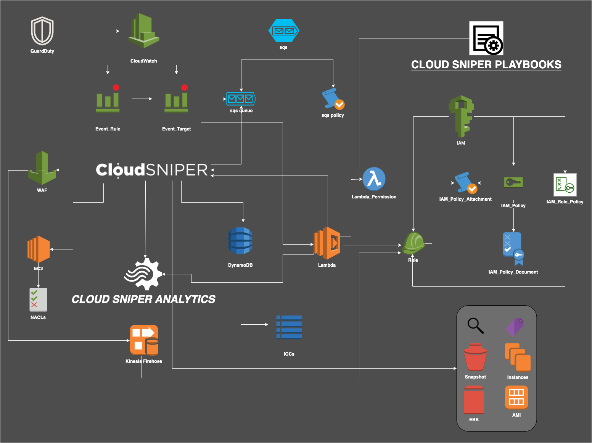

<br> </br>

### AWS terraform deployment

<div style="text-align:center"></div>
<br> </br>

***Cloud Sniper*** uses [terraform](https://www.terraform.io/) to automatically deploy the entire infrastructure. Each functionality will be added in terraform stacks format. A stack has a holistic approach, which does not generate dependencies with another stack and can be added 100% to a deployment plan just by filling in the necessary input variables.

The requirements include:

1. AWS cli
2. A programmatic_access_key|role for AWS
3. An AWS local profile configured
4. terraform client

To deploy Cloud Sniper you should run:

1. ~$ git clone https://github.com/cloud-sniper/cloud-sniper.git
2. ~$ cd cloud-sniper/terraform/[stack-name]
3. Set the corresponding environment variables in the variables.tf file
4. Create main.tf file with your credentials or use your role as appropriate

```
   provider "aws" {
    region                    = "region"
    shared_credentials_file   = "/your-home/.aws/credentials"
    profile                   = "your-profile"
   }
```
5. ~/[stack-name]$ terraform init
6. ~/[stack-name]$ terraform plan
7. ~/[stack-name]$ terraform apply [yes]
